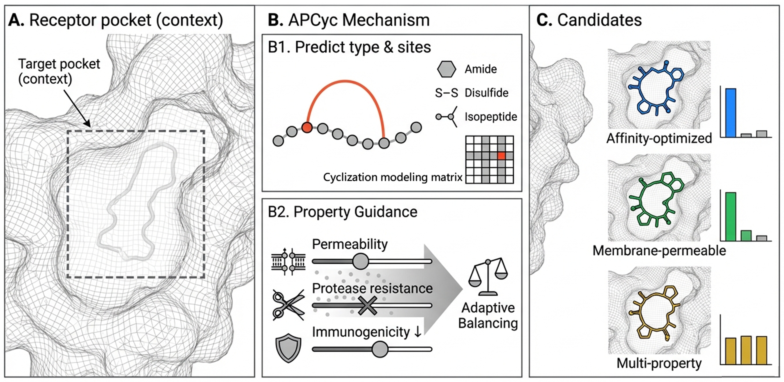

# APCyc: Autonomous Cyclization and Property-Aware Design for Cyclic Peptides

<div align="center">

Yifan Zhao<sup>*</sup>, Lang Qin<sup>*</sup>, Jintai Chen<sup>†</sup>

The Hong Kong University of Science and Technology (Guangzhou)

[](#citation)
[](https://github.com/HKUSTGZ-ML4Health-Lab/APCyc)
[](LICENSE)
[](env.yaml)

</div>

<div align="center">
  
</div>

## Abstract

Cyclic peptides are attractive therapeutic candidates because they can combine strong binding affinity with improved stability. APCyc is a target-aware de novo generation framework for pocket-adaptive cyclic peptide design. It explicitly models cyclization types and cyclization sites, expands the residue vocabulary for cyclic structures, and uses Bayesian posterior guidance to steer sampling toward peptides satisfying multiple property objectives such as affinity, permeability, protease resistance, and immunogenicity.

## Highlights

* Pocket-conditioned cyclic peptide generation with explicit cyclization-site modeling.
* Support for multiple cyclization patterns, including amide, disulfide, and isopeptide constraints.
* Property-aware sampling through posterior guidance and adaptive multi-objective balancing.
* Evaluation utilities for structure validity, cyclization success, energy, affinity, diversity, and MD-derived reports.
* Backward-compatible PepGLAD-style training, sampling, and dataset interfaces.

## Repository Layout

```text
APCyc/
|-- apcyc/                 # APCyc model, cyclic modules, guidance, and evaluation pipeline
|-- api/                   # Pocket extraction and one-command inference APIs
|-- configs/               # Training, sampling, router, and property-predictor configs
|-- data/                  # Dataset and PDB/block conversion utilities
|-- evaluation/            # PepGLAD-compatible baseline metrics and dG utilities
|-- models/                # Autoencoder, latent diffusion, and dyMEAN backbones
|-- router/                # Cyclization-pair router data/model utilities
|-- scripts/               # Data processing, post-processing, and analysis scripts
|-- trainer/               # Training loops
|-- utils/                 # Shared logging, config, registry, and tensor helpers
|-- bash/                  # Thin runnable examples following the project defaults
|-- docs/                  # Quickstart and reproduction notes
|-- examples/              # Minimal examples for pocket extraction and generation
|-- requirements/          # Runtime and development dependency lists
`-- env.yaml               # Recommended conda environment
```

## Installation

The recommended setup is the conda environment in `env.yaml`:

```bash
conda env create -f env.yaml
conda activate APCyc
```

The original experiments were developed with CUDA 11.7 and PyTorch 1.13.1. Optional tools such as PyRosetta, AutoDock Vina, FoldX, Amber, and TM-score are only required for the corresponding evaluation modules.

For editable development:

```bash
pip install -e .
pip install -r requirements/dev.txt
```

## Data And Checkpoints

Datasets, generated structures, experiment outputs, and model checkpoints are intentionally kept out of git. Put released weights under `checkpoints/` when available:

```text
checkpoints/
|-- codesign.ckpt          # Default checkpoint for sequence-structure co-design
|-- fixseq.ckpt            # Default checkpoint for binding conformation generation
`-- codesign_pepbdb.ckpt   # Optional PepBDB checkpoint
```

PepBench and PepBDB preprocessing follows the original PepGLAD-compatible pipeline. See [docs/reproduction.md](docs/reproduction.md) for the full command list.

## Inference

Extract a receptor pocket from a complex PDB:

```bash
python -m api.detect_pocket \
  --pdb assets/1ssc_A_B.pdb \
  --target_chains A \
  --ligand_chains B \
  --out assets/1ssc_A_pocket.json
```

Run peptide sequence-structure co-design:

```bash
CUDA_VISIBLE_DEVICES=0 python -m api.run \
  --mode codesign \
  --pdb assets/1ssc_A_B.pdb \
  --pocket assets/1ssc_A_pocket.json \
  --ckpt checkpoints/codesign.ckpt \
  --out_dir outputs/codesign \
  --length_min 8 \
  --length_max 15 \
  --n_samples 10
```

Run binding conformation generation for a fixed peptide sequence:

```bash
CUDA_VISIBLE_DEVICES=0 python -m api.run \
  --mode struct_pred \
  --pdb assets/1ssc_A_B.pdb \
  --pocket assets/1ssc_A_pocket.json \
  --ckpt checkpoints/fixseq.ckpt \
  --out_dir outputs/struct_pred \
  --peptide_seq PYVPVHFDASV \
  --n_samples 10
```

The helper scripts in `bash/` wrap the same commands while preserving the explicit config and checkpoint paths.

## Training

Train with a YAML config:

```bash
GPU=0 bash scripts/train.sh configs/apcyc/apcyc_ae.yaml
```

Run the integrated autoencoder, latent diffusion, generation, and evaluation pipeline:

```bash
GPU=0 bash scripts/run_exp_pipe.sh \
  apcyc_experiment \
  configs/pepbench/autoencoder/train_codesign.yaml \
  configs/pepbench/ldm/train_codesign.yaml \
  configs/pepbench/ldm/setup_latent_guidance.yaml \
  configs/pepbench/test_codesign.yaml
```

APCyc-specific sampling configs live in `configs/apcyc/`, and property guidance configs live in `configs/apcyc/property/`.

## Evaluation

The main APCyc evaluator is available through:

```bash
python -m apcyc.evaluation.eval_runner \
  --manifest outputs/apcyc_predictions.jsonl \
  --outdir outputs/eval \
  --config apcyc/evaluation/configs/eval_default.yaml
```

MD input generation and reporting utilities are documented in [apcyc/evaluation/README.md](apcyc/evaluation/README.md).

## Development

This repository follows the lightweight engineering style used by HKUSTGZ-ML4Health-Lab projects:

```bash
make syntax      # Python syntax check without running experiments
make lint        # flake8 with the project setup.cfg
make format      # isort + yapf, if installed
```

The checks are source-level only; they do not require model weights or datasets.

## Acknowledgements

APCyc builds on the PepGLAD codebase and keeps compatibility with PepGLAD data formats and training interfaces. We thank the PepGLAD authors for the open-source foundation.

## Citation

If you find APCyc useful, please cite:

```bibtex
@article{zhao2026apcyc,
  title   = {APCyc: Autonomous Cyclization and Property-Aware Design for Cyclic Peptides},
  author  = {Zhao, Yifan and Qin, Lang and Chen, Jintai},
  journal = {To appear},
  year    = {2026}
}
```
